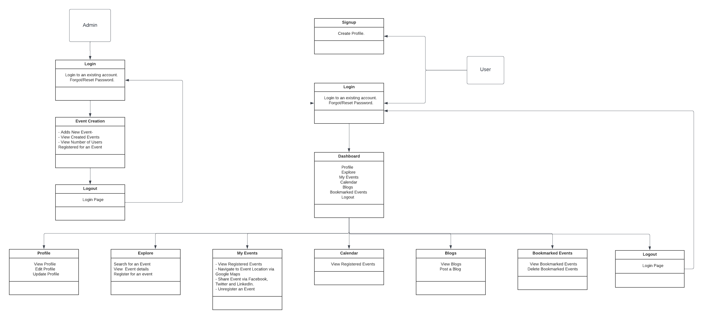

<h3>TITLE OF THE PROJECT</h3>             

**Husky Events**
                                                
  
                                        ========================================
                                                     INTRODUCTION
                                        ========================================

**Team Name:**  Web Surfers            
 
**Team Members**
1. Varsha Reddy Kumbham                        
2. Devika Boddu                    
3. Sindhura Bandaru               
4. Sahithi Gaddam           

                                        ========================================
                                                     PROBLEM STATEMENT
                                        ========================================    

**Description**           
As an University Student it is really difficult to gather information about events from  Social Media(Instagram, Facebook, Whatsapp... etc ) beside completing assignments and term exams. Imagine if we could have a website having all the details about different events where everyone can register and track them in a single go.             

                                        ========================================
                                                    USER REQUIREMENTS
                                        ========================================   

1.  User should be able to Login as an existing person/ Sign up for a new Profile.                      
2.  End User should be able to access all the events being held in the university(Search and Sort Events).                        
3.  Bookmark/Wishlist an event so that he can comeback later to checkout.  
4.  Event Categories can be added under Interested events.                                  
5.  Register for an event.            
6.  Confirmation email with the Event Details.    
7.  Section for My Events where user can see the list of registered events.                              
8.  Notification email to the user when a new Event is added which matches the User's Interest.             
9.  Calender to display the different events under the registered dates.                             
10. Blogs to display the user experience of the event.             

                                        ========================================
                                                    DOMAIN MODEL
                                        ========================================                 

**Work Flow**            

                        

